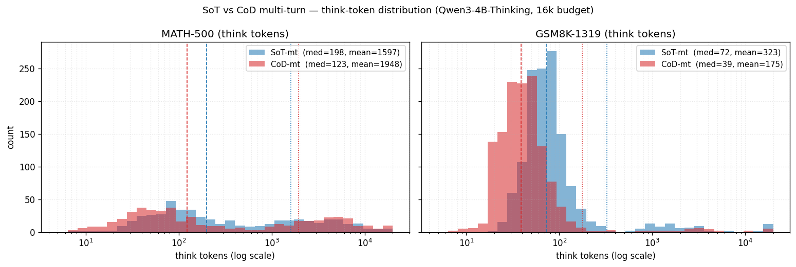
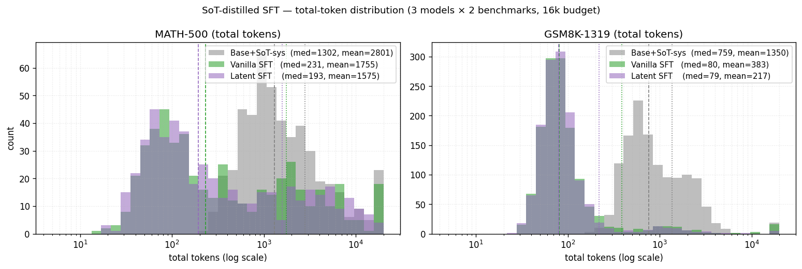

# SoT vs CoD prompting + SoT-distilled SFT — Qwen3-4B-Thinking-2507 (20260503)

*Two experiments in one report. (1) Head-to-head comparison of SoT and CoD
multi-turn prompting on MATH-500 / GSM8K-1319. (2) SFT-distillation of the
SoT-multiturn teacher into the base model (vanilla and Copy-mode latent),
then 3-models × 2-benchmarks eval. Base model is Qwen3-4B-Thinking-2507
throughout. Decomposition `accuracy = %term × P(correct | term)`
(`20260420 §4`) is the lens for both.*

## TL;DR

| comparison | best accuracy | best per-token efficiency | key cost |
|---|---|---|---|
| **SoT-mt vs CoD-mt** (no SFT, 16k budget) | **SoT-mt** by +2.6 (MATH) / **+11.2 (GSM8K)** | SoT-mt on both | CoD's terse 5-word drafts drop variable bindings → wrong arithmetic on multi-step problems |
| **Base vs Vanilla-SFT vs Latent-SFT** (SoT system prompt at eval) | **Base** (MATH 70.4%, GSM8K **94.1%**) | **Latent SFT** (acc/1k tok 0.42 MATH, **4.02 GSM8K**) | SFT compresses median tokens 80–90%, costs 3–5 pts of accuracy |

Five findings:

1. **SoT-mt > CoD-mt by +11.2 pts on GSM8K**, entirely in `P(correct | term)`. Chunked-symbolism's `c_exp = 5 * 1.2 = 6` keeps a name; CoD's `5 + 1 = 6` strands the constant.
2. **CoD has a long-tail blow-up after `</think>`** — mean post-think tokens jump 28 → 215 on GSM8K (×7.7), 63 → 595 on MATH (×9.4); medians barely move. The "after `</think>` only `\boxed{}`" rule structurally breaks under pressure.
3. **Token distributions are heavily right-skewed** — mean / median ratios run 2× to **16×** across the cells. Histograms on log-scale (Fig 1, Fig 2) are necessary to see the shape; reporting a single mean misleads.
4. **Base + SoT system prompt @ 16k beats SoT-mt + 16k** — MATH 65.0% → 70.4%, GSM8K 88.8% → 94.1%. The system prompt alone on a Thinking model with enough budget is the strongest configuration we've found; the few-shot exemplars only help when paired with format internalisation.
5. **SoT-distilled SFT compresses median tokens 80-90% but loses 3-5 pts**. Latent (Copy-mode) ≈ vanilla in behaviour (byte-identical visible output on most cases) — slightly more compact, ~1-1.5 pt worse, never better.

---

# Part A — SoT vs CoD multi-turn prompting

## A.1 Setup

Both methods use the same multi-turn ChatML scaffold: each exemplar lives
in a real `<|im_start|>assistant\n<think>...\\boxed{}<|im_end|>` turn (hand-
constructed because Qwen3-Thinking's chat template strips `<think>` from
past assistant turns — the obstacle that motivated `20260427 §4`). The
final assistant turn is primed with `<|im_start|>assistant\n<think>\n`. The
only thing that differs across cells is the *content* of the few-shot
exemplars.

| method | system-prompt rule | 3 exemplars (same for both MATH and GSM8K) | reasoning style |
|---|---|---|---|
| **SoT** | "Use equations & variables. One per line. After `</think>`, only `\boxed{}`." | car kinematics, percent-discount MCQ, Ohm's-law circuit (verbatim from `SimonAytes/SoT/exemplars.json`) | `a = 2.5 m/s²; t = 10 s; vi = 15 m/s; vf = 15+(2.5×10) = 40 m/s` |
| **CoD** | "Each thinking step ≤ 5 words; one operation per line; no narration; no restating." | trees / chocolates / bagels (3 from `chain-of-draft/configs/gsm8k_cod.yaml`) | `21 - 15 = 6` |

Both system prompts end with the *same* "after `</think>`, output ONLY
`\boxed{ANSWER}`" rule. CoD exemplars were ported from the canonical CoD
GSM8K pool, reformatted with `<think>...</think>\boxed{...}` so the same
extractor works for both methods (deviates from CoD's `Q:.../A:...####`
layout, but is necessary to make the comparison single-variable: only the
few-shot *content* differs). Eval: vLLM 0.10.2, bf16, `max_tokens=16384`,
`max_model_len=17408`, greedy. The SoT-mt MATH-500 cell is reused
unchanged from `20260427 §4`.

### A.1.1 Full exemplars

**SoT — kinematics:**
> Q: A car accelerates at 2.5 m/s² for 10 seconds. Initial velocity 15 m/s. Final velocity?
> A: ` <think>\n a = 2.5 m/s^2\n t = 10 s\n vi = 15 m/s\n vf = 15 + (2.5 × 10)\n vf = 40 m/s\n </think>\n \boxed{40} `

**SoT — percent discount (MCQ):**
> Q: Product costs $120, 15% discount, final price? Choices: A) $10, B) $97, C) 102.
> A: ` <think>\n op = 120\n d = 15%\n dp = 120 × (15 / 100) = 18\n fp = 120 - 18 = 102\n </think>\n \boxed{C} `

**SoT — Ohm's law:**
> Q: V=12V, R=4Ω, what is I?
> A: ` <think>\n V = 12V\n R = 4Ω\n I = 12 / 4 = 3A\n </think>\n \boxed{3} `

**CoD — trees / chocolates / bagels** (compressed):
> Q1 → ` <think>\n 21 - 15 = 6\n </think>\n \boxed{6} `
> Q2 → ` <think>\n 32 + 42 = 74\n 74 - 35 = 39\n </think>\n \boxed{39} `
> Q3 → ` <think>\n 5 * 3 = 15\n 23 - 15 = 8\n </think>\n \boxed{8} `

The structural contrast: every SoT line names the LHS (`a = …`, `vf = …`,
`op = …`); every CoD line is an unnamed expression. This is the difference
that drives §A.3.1's GSM8K failure mode.

## A.2 Headline 4-cell table

| cell | n | **acc** | %term | P(c\|t) | %cap | mean think | **median think** | mean total | median total | mean post\|term | acc/1k tok |
|---|---:|---:|---:|---:|---:|---:|---:|---:|---:|---:|---:|
| **SoT-mt MATH-500** | 500 | **65.0%** | 99.0% | 65.7% | 0.8% | 1,597 | 198 | 1,660 | 208 | 63 | **0.392** |
| CoD-mt MATH-500 | 500 | 62.4% | 98.0% | 63.7% | 3.6% | 1,949 | **124** | 2,532 | 252 | 595 | 0.246 |
| **SoT-mt GSM8K-1319** | 1319 | **88.8%** | 98.9% | 89.3% | 1.1% | 324 | 72 | 352 | 81 | 28 | **2.522** |
| CoD-mt GSM8K-1319 | 1319 | 77.6% | 99.6% | 77.9% | 1.1% | 176 | **39** | 390 | 50 | 215 | 1.989 |

Sample-level overlap: **MATH-500** — both correct 284, SoT-only 41,
CoD-only 28, both wrong 147. **GSM8K-1319** — both correct 973, **SoT-only
198**, CoD-only 51, both wrong 97. SoT wins ~4× as many sole victories on
GSM8K.

## A.3 Token distribution (Fig 1)



*Histograms of think tokens on log scale; dashed = median, dotted = mean.*

The distributions are **bimodal**: a tall cluster of short responses near
the median, and a long tail of capped-or-near-capped responses. The
mean/median ratio quantifies the skew:

| cell | median | mean | p99 | mean/median |
|---|---:|---:|---:|---:|
| SoT-mt MATH | 198 | 1,597 | 14,949 | 8.1× |
| **CoD-mt MATH** | 124 | 1,948 | 16,384 | **15.8×** |
| SoT-mt GSM8K | 72 | 323 | 5,869 | 4.5× |
| CoD-mt GSM8K | 39 | 175 | 3,551 | 4.5× |

The MATH **CoD long tail is twice as fat as SoT's** — a 16× mean/median
gap means a small share of catastrophic over-runs dominates the average.
That share is exactly the §A.3.2 failure mode: 5-word drafts that didn't
land an answer, followed by thousands of tokens of post-think prose CoT.

## A.3.1 GSM8K failure: terse drafts drop variable bindings

`gsm8k_test_661` ("normal coffee $5; on Wednesday it costs 20% more; one
daily for a week + $2 donut; total?", gold = 44):
- **SoT (correct, think 57)**: `c_normal=5; c_exp=5*1.2=6; days=7; coffee_cost=6*7=42; donut=2; total=42+2=44` → `\boxed{44}`
- **CoD (wrong, think 34)**: `20% of 5 = 1; 5 + 1 = 6; 7 * 1 = 7; 7 + 2 = 9` → `\boxed{9}`

The CoD draft loses the binding "the per-day cost is 6", carries forward
"7 × 1" (treating the markup as the price), and the chain inherits the
bug. SoT's `c_exp = 5 * 1.2 = 6` *names* the result so the next line is
forced to multiply by 7. Same mechanism on `gsm8k_test_1312` (six
reservations) and `gsm8k_test_770` (Vivian / Fred candles, where CoD just
emits `5 - 2 = 3` and stops). The −11.2 pt GSM8K gap sits entirely in
`P(correct | term)` — `%term` is *higher* for CoD (99.6% vs 98.9%); the
model commits to wrong answers.

## A.3.2 MATH failure: post-`</think>` prose explosion

The three CoD-MATH wrong samples with the longest post-think output:

- `math_test_381`: think 19 tokens (`1 + x > y; 1 + y > x; x + y > 1`),
  then **16,365 tokens** of full prose CoT after `</think>`, never
  reaches `\boxed{}`, gets cut off.
- `math_test_499`: think 37, post **16,347**, output begins
  `\boxed{164}\n<think>\n\nFirst, I need to understand the problem...` —
  the model emits the boxed answer, then *re-opens* `<think>` and starts
  over.
- `math_test_256`: emits a (correct-looking) `\boxed{8/21}` then writes
  16,320 tokens of step-by-step verification before the budget cap.

The "after `</think>` only `\boxed{}`" system rule **structurally
breaks** under pressure. SoT does this rarely (mean post-think 63 on
MATH); CoD does it 9.4× more (mean 595). On the median problem CoD is
fine — but the long tail destroys per-token efficiency. CoD-MATH's
correct-only mean think is 1,341; wrong-only mean is **2,957** — when
the format isn't enough, the model spends 2× more think tokens and still
fails.

## A.4 Pareto frontier (MATH-500)

Stitching with `20260427 §4`:

| frontier point | acc | mean tokens | acc / 1k tok |
|---|---:|---:|---:|
| Vanilla CoT 16k (`20260427`) | 71.0% | 4,849 | 0.146 ← raw peak |
| **SoT-mt 16k** | 65.0% | 1,660 | 0.392 |
| **CoD-mt 16k** | 62.4% | 2,532 | 0.246 ← *dominated by SoT-mt* |

CoD-mt is **strictly Pareto-dominated** on MATH — lower accuracy *and*
more tokens than SoT-mt. The mean total token cost is half of vanilla
CoT for a worse accuracy than SoT-mt. (GSM8K has no prior frontier; SoT
strictly wins this cell.)

---

# Part B — SoT-distilled SFT: vanilla and Copy-mode latent

## B.1 Pipeline (mirrors `20260427 §1` TokenSkip; teacher prompt swapped)

| step | what | cost |
|---|---|---|
| 1. Collect | `sft.methods.sot.collect`: 16 SoT-multiturn samples / Q at T=0.7, max 4096, sharded across 4 GPUs | MATH 3,000 Q: ~85 min on 4×A100; GSM8K 7,473 Q: ~22 min |
| 2. Select | `sft.methods.sot.select`: top-4 shortest correct per Q; drop 0-correct Qs | seconds |
| 3. Build SFT data | `sft.methods.sot.build_sft_data`: render `[system: SoT, user: question, assistant: <think>{teacher}</think>\boxed{ANS}]` — combined MATH+GSM8K | seconds |
| 4. Train | full FT, `paged_adamw_8bit`, 4×A100; vanilla `max_length=4096`, latent `max_length=2048` (latent OOM'd at 4096 due to doubled lm_head) | vanilla 3:54 hr, latent 9:11 hr |
| 5. Eval | `sft.eval_raw --sot-prompt --sot-system-only` (new flag): SoT system prompt + raw question, **no exemplars**; greedy, 16k budget | ~10–20 min/cell |

Fixed knobs: `max_steps=1200`, effective batch **64** (1×16×4),
`lr=1e-5` `constant_with_warmup`, `warmup_ratio=0.1`, all-positions loss.
At 1200×64=76,800 examples seen → ~2.08 epochs through 36,851 SFT rows.

| stage | MATH | GSM8K | combined |
|---|---:|---:|---:|
| Train Qs seen | 3,000 | 7,473 | — |
| 16/Q samples | 48,000 | 119,568 | 167,568 |
| sample-correct rate | 59.5% | 72.3% | 68.7% |
| Qs with ≥1 correct | 2,059 (68.6%) | 7,284 (97.5%) | — |
| **top-4 SFT rows** | **8,020** | **28,831** | **36,851** |
| selected reasoning median | 108 | 60 | — |

**Models:**
- *Base*: `Qwen/Qwen3-4B-Thinking-2507`.
- *Vanilla SFT*: `results/sft/sot_distill/vanilla/` — final loss `0.067`.
- *Latent SFT*: `results/sft/sot_distill/latent/` — built from the
  Copy-mode dual checkpoint (latent rows = visible rows at init, cosine
  1.0); `<think>` token IDs remapped to latent (`t+V`) at data-prep time;
  final loss `0.18`.
- W&B: vanilla → [`sot-distill/77w9unyj`](https://wandb.ai/wl2984-columbia-university/sot-distill/runs/77w9unyj) (post-hoc synced from `trainer_state.json`); latent → [`huggingface/ugz9bfsq`](https://wandb.ai/wl2984-columbia-university/huggingface/runs/ugz9bfsq) (live).

**Asymmetry to flag:** vanilla `max_length=4096`, latent `max_length=2048`
— OOM-driven, not by choice. ~5–10% of MATH SFT rows truncated for
latent vs ~1% for vanilla. Likely source of the small (1–1.5 pt) latent–vanilla gap.

## B.2 Headline 6-cell table

| cell | n | **acc** | %term | P(c\|t) | %cap | mean think | **median think** | mean total | **median total** | mean post\|term | acc/1k tok |
|---|---:|---:|---:|---:|---:|---:|---:|---:|---:|---:|---:|
| **Base (SoT-sys) MATH-500** | 500 | **70.4%** | 97.6% | 72.1% | 4.6% | 2,347 | 1,094 | 2,801 | 1,302 | 465 | 0.251 |
| Vanilla SFT MATH-500 | 500 | 67.6% | 97.6% | 69.3% | 3.6% | 1,660 | 220 | 1,755 | 232 | 97 | 0.385 |
| Latent SFT MATH-500 | 500 | 66.6% | 99.4% | 67.0% | 0.6% | 1,550 | **182** | **1,575** | **194** | 25 | **0.423** |
| **Base (SoT-sys) GSM8K-1319** | 1319 | **94.1%** | 99.7% | 94.3% | 1.4% | 855 | 574 | 1,350 | 759 | 497 | 0.697 |
| Vanilla SFT GSM8K-1319 | 1319 | 88.8% | 99.3% | 89.1% | 1.2% | 304 | 70 | 384 | 80 | 80 | 2.313 |
| Latent SFT GSM8K-1319 | 1319 | 87.3% | 99.6% | 87.6% | 0.4% | **207** | 70 | **217** | 79 | **10** | **4.017** |

Sample-level overlap (per-question, across the three models):

| benchmark | base both vanilla | base only | vanilla only | both wrong | vanilla both latent | vanilla only | latent only | both wrong |
|---|---:|---:|---:|---:|---:|---:|---:|---:|
| MATH-500 | 328 | 24 | 10 | 138 | 307 | 31 | 26 | 136 |
| GSM8K-1319 | 1,139 | **102** | 32 | 46 | 1,106 | 65 | 46 | 102 |

Vanilla and latent are ~85-87% identical at the question level.

## B.3 Token distribution (Fig 2)



*Total-token distribution per model, log scale; dashed = median, dotted = mean.*

| cell | median | mean | p90 | mean/median |
|---|---:|---:|---:|---:|
| Base MATH | 1,302 | 2,801 | 6,698 | 2.2× |
| Vanilla MATH | 231 | 1,755 | 5,289 | **7.6×** |
| Latent MATH | 193 | 1,575 | 5,359 | **8.1×** |
| Base GSM8K | 759 | 1,350 | 2,555 | 1.8× |
| Vanilla GSM8K | 80 | 383 | 208 | 4.8× |
| **Latent GSM8K** | 79 | 217 | 163 | 2.8× |

Two non-obvious shape facts the histogram makes visible:

- **SFT *flattens* the median but inherits a long tail.** Median total
  collapses from 1,302 → 231 (MATH) and 759 → 80 (GSM8K) — but the
  mean drops only 2.8 → 1,755 (MATH) and 1,350 → 383 (GSM8K). The 8×
  mean/median ratio for vanilla MATH means a small share of problems
  (~10%) still produces 5k+ tokens — likely the same compression-
  overflow problems as Part A's `gsm8k_test_267` (cooking time).
- **Latent's tail is shorter than vanilla's on GSM8K** (mean 217 vs 383
  at the same median 79). The dual-vocab constraint structurally
  suppresses post-think prose: mean post-think 80 → 10 (87% reduction).
  This is what gives latent the 4.0 acc/1k tok — same accuracy floor as
  vanilla, but the long tail is gone.

## B.4 Three findings

### B.4.1 SFT compresses ~85% but loses 3-5 pts of accuracy

| benchmark | model | median total | Δ vs base | acc | Δ vs base |
|---|---|---:|---:|---:|---:|
| MATH | base | 1,302 | — | 70.4% | — |
| MATH | vanilla SFT | 232 | **−82%** | 67.6% | −2.8 |
| MATH | latent SFT | 194 | **−85%** | 66.6% | −3.8 |
| GSM8K | base | 759 | — | 94.1% | — |
| GSM8K | vanilla SFT | 80 | **−89%** | 88.8% | −5.3 |
| GSM8K | latent SFT | 79 | **−90%** | 87.3% | −6.8 |

Base + SoT system prompt + 16k budget is *already* very strong on GSM8K
(94.1%) — with mean think 855, median 574, post-think mean 497 (it uses
the budget). SFT compresses the output style aggressively into chunked
symbolism but does not lift the model's MATH ceiling — it *trades*
length for compactness. `%term` is at ceiling everywhere (97-99.7%); the
entire accuracy gap sits in `P(correct | term)`.

This matches `20260427 §3.2`'s "in-context exemplars train the *output*
phase, not the reasoning phase". Distilling exemplars into the weights
internalises the output style (the model now does it unconditionally),
but doesn't make the model reason better.

### B.4.2 Latent (Copy-mode) ≈ vanilla in behaviour

On `gsm8k_test_165` (Elvira's €1500 budget) both SFT models produce
**byte-identical** visible reasoning:

> **Vanilla** (think 84, total 93):
> ```
> b = 1500
> c = 1090; s = 157; b = 74; p = 102
> total = 1090 + 157 + 74 + 102 = 1423
> left = 1500 - 1423 = 77
> ```
> `\boxed{77}` ✓
>
> **Latent** (think 84, total 93): *identical* (the eval harness decodes
> latent IDs back to visible for display; the only raw difference is the
> latent IDs in `[V, V+L)` inside `<think>`, 95-98% of generated tokens).

Where they differ in aggregate: latent is more compact (GSM8K mean total
**384 → 217**, mean post-think **80 → 10**). Latent loses 1–1.5 pts
accuracy, scattered across the test set without obvious topical
clustering — consistent with the asymmetric `max_length` + the small
embedding-row drift accumulated during 1,200 steps from identical
clones.

### B.4.3 Where SFT hurts: compressed reasoning drops working memory

`gsm8k_test_267` (cooking time, gold = 91):
- Base (think 2,346, **correct**): 2k of prose carefully tracking
  warming time vs cooking time — heat 20 min, +40% to reach high temp
  (28 min), cook in (warming − 5) min, sums to 91.
- Vanilla SFT (think 59, **wrong, ans 71**): collapses to `t1 = 20; t2
  = 20*1.4 = 28; t3 = 28-5 = 23; total = 20+28+23 = 71` — mis-attributes
  the "−5" to the cooking time directly instead of (warming − 5).
- Latent SFT: byte-identical to vanilla, also wrong.

**102 GSM8K questions follow this pattern** (base-only-correct, both
SFT models wrong). The terse format collapses two sequential
quantities into the same surface form, and the model loses track of
which is which — same failure mode as Part A §A.3.1 (CoD GSM8K), now
inside the SFT'd weights instead of the prompt.

## B.5 Pareto frontier across both reports

Sorting by (mean total tokens, accuracy):

| benchmark | frontier point | acc | mean tokens | acc/1k tok |
|---|---|---:|---:|---:|
| GSM8K | **Latent SFT** | 87.3% | 217 | **4.017** ← per-token king |
| GSM8K | Vanilla SFT | 88.8% | 384 | 2.313 |
| GSM8K | SoT-mt | 88.8% | 352 | 2.522 |
| GSM8K | **Base + SoT-sys** | **94.1%** | 1,350 | 0.697 ← raw acc king |
| MATH | **Latent SFT** | 66.6% | 1,575 | **0.423** |
| MATH | Vanilla SFT | 67.6% | 1,755 | 0.385 |
| MATH | SoT-mt | 65.0% | 1,660 | 0.392 |
| MATH | **Base + SoT-sys** | 70.4% | 2,801 | 0.251 |
| MATH | Vanilla CoT 16k (`20260427`) | **71.0%** | 4,849 | 0.146 ← raw acc king |

CoD cells, SoT-suppress, and base sampling are all dominated.

---

# C. Cross-cutting reading

The same `accuracy = %term × P(correct | term)` decomposition explains
every finding:

- **`%term` is solved** at 97-99.7% across every cell — by sufficient
  budget (base), by SFT format internalisation (vanilla, latent), or by
  both. No longer the binding constraint at this base/dataset.
- **`P(correct | term)` moves with the *style of reasoning the model
  commits to***: 94.3% (base GSM8K, long prose CoT) → 89.1% (vanilla
  SFT, terse CS) → 87.6% (latent SFT, terse CS in latent vocab) → 77.9%
  (CoD-mt prompt). Long prose preserves working memory; compressed
  reasoning loses it. SoT's named-variable form is **the
  middle-ground** — terse but with bindings.
- **MATH ceiling band** identified in `20260427 §3` (~65–75%) holds across
  every MATH cell here: 62.4% (CoD-mt) → 70.4% (Base+SoT-sys). Prompt
  format and SFT shift along this band but don't break the ceiling.
- **Heavy-tailed distributions** (Fig 1, Fig 2) — *every* prompt/method
  configuration produces a long tail of cap-or-near-cap responses on
  hard problems. Reporting only the mean hides 50-90% of the
  distribution shape; reporting only the median hides the cost. Both
  are needed.

**Implication for next steps:**
1. The strongest single configuration is **base + SoT system prompt + 16k
   budget** (no exemplars, no SFT). Beats every prompted/SFT'd alternative on
   raw accuracy.
2. SFT is the right tool when **per-token efficiency** matters more than
   the last 5 pts of accuracy (e.g. agent loops, latency-sensitive serving).
3. **Copy-mode latent is ~equivalent to vanilla** on output; if the goal is
   accuracy gain, the next experiment is **non-Copy-mode** init (random or
   noise) so the latent embedding can specialize differently from visible.

---

# D. Files

| artefact | path |
|---|---|
| **Code** | |
| CoD prompt module | `sft/methods/cod/prompts.py` |
| SoT collect / select / build_sft_data | `sft/methods/sot/{collect,select,build_sft_data}.py` |
| `--sot-system-only` flag | `sft/eval_raw.py`, `sft/methods/sot/prompts.py:build_sot_system_only_prompt` |
| Optimizer plumbing | `sft/train.py` (`cfg.training.optim`) |
| Post-hoc W&B sync | `scripts/sft/wandb_sync_post.py` |
| Configs | `config/sft/sot_distill_{vanilla,latent}.yaml` |
| **Data** | |
| Collected SoT samples | `data/sft/sot/collected/{math,gsm8k}/shard_*.jsonl` (167,568 rows) |
| Selected top-4 | `data/sft/sot/selected/{math,gsm8k}_top4.jsonl` |
| Combined SFT data | `data/sft/sot/sft_combined.jsonl` (36,851 rows) |
| **Models** | |
| Vanilla SFT | `results/sft/sot_distill/vanilla/` |
| Latent SFT | `results/sft/sot_distill/latent/` |
| **Eval JSONLs** | |
| SoT-mt MATH-500 | `results/sft/math/phase1_sot/eval/sot_thinking_on_multiturn_16k.jsonl` (reused from `20260427 §4`) |
| SoT-mt GSM8K + CoD-mt MATH/GSM8K | `results/sft/cod_vs_sot/eval/{sot_mt_gsm8k,cod_mt_math,cod_mt_gsm8k}_16k.jsonl` |
| Base / Vanilla / Latent × MATH / GSM8K | `results/sft/sot_distill/eval/{base,vanilla,latent}_{math,gsm8k}.jsonl` |
| Aggregated metrics | `results/sft/{cod_vs_sot,sot_distill}/eval/all_metrics.json` |
| **Figures** | |
| Fig 1 (SoT vs CoD think tokens) | `figures/fig_sot_vs_cod_think_tokens.png` |
| Fig 2 (SFT-distill total tokens) | `figures/fig_sft_distill_total_tokens.png` |
| **W&B** | |
| Vanilla SFT | `wandb.ai/wl2984-columbia-university/sot-distill/runs/77w9unyj` |
| Latent SFT | `wandb.ai/wl2984-columbia-university/huggingface/runs/ugz9bfsq` |

*(Supersedes `20260503_2.md`, which contained the SFT-distill section
in standalone form.)*
